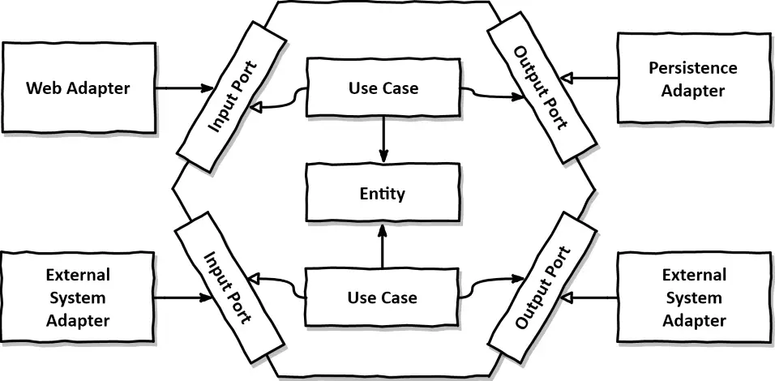

# Backend Architecture: Ports & Adapters (Hexagonal Architecture)
This project is built using the Ports & Adapters architectural pattern (also known as Hexagonal Architecture). This approach aims to create a loosely coupled application core that is independent of frameworks, user interfaces, databases, and external systems.

<table>
  <tr>
    <td width="40%">
      
    </td>
    <td width="60%">
      

        The ports & adapters rely on Clean Architecture using the Dependency Inversion Principle. By isolating the business logic, high testability, maintainability, and the flexibility to swap out infrastructure components is ensured without affecting the core domain.
      

    </td>
  </tr>
</table>

Hexagonal Architecture solves this by defining [`incoming & outgoing ports`](https://github.com/MoQel/QuaK/tree/development/backend/src/main/java/edu/kit/quak/application/filesystem/ports) via dependency injection.

[`Input ports`](https://github.com/MoQel/QuaK/tree/development/backend/src/main/java/edu/kit/quak/application/filesystem/ports/in) specify the interface through which the application can be accessed. 
Various adapters—such as [`web controllers`](https://github.com/MoQel/QuaK/tree/development/backend/src/main/java/edu/kit/quak/infrastructure/in/web/rest), messaging systems, or other external systems—use these input ports to invoke the use cases via dependency injection.

The [`use cases`](https://github.com/MoQel/QuaK/tree/development/backend/src/main/java/edu/kit/quak/application/filesystem/services) implement the input ports and encapsulate the **business rules**, operating on [`domain entities`](https://github.com/MoQel/QuaK/tree/development/backend/src/main/java/edu/kit/quak/core/filesystem/model) that represent the core domain model. 

[`Output ports`](https://github.com/MoQel/QuaK/tree/development/backend/src/main/java/edu/kit/quak/application/filesystem/ports/out) define how the system interacts with external resources, such as databases or external services.

[`Persistence Adapters`](https://github.com/MoQel/QuaK/tree/development/backend/src/main/java/edu/kit/quak/infrastructure/out/db/jpa) implement these [`output ports`](https://github.com/MoQel/QuaK/tree/development/backend/src/main/java/edu/kit/quak/application/filesystem/ports/out), allowing the infrastructure to be swapped or replaced without affecting the core business logic, ensuring high maintainability, testability, and flexibility.

#### `infrastructure/{domain}/in/web/rest`

Defines the web adapters and therefore the entry points of the application.
Communication between frontend and backend is done via Data Transfer Objects (DTOs).
The subpackage infrastructure/{domain}/in/web/rest/mapper contains mappers that translate
between DTOs and domain POJOs.

#### `application/{domain}/ports/in`

Defines the input ports of the application.
These ports are implemented by services located in application/{domain}/services.
The services represent the use cases and encapsulate the business rules.

#### `application/{domain}/ports/out`

Defines the output ports used by application services to interact with external systems
(e.g. persistence, file access, configuration sources).

#### `core/{domain}/model`

Contains the domain model expressed as pure POJOs.
Domain entities have no dependencies on application or infrastructure layers.

##### `infrastructure/{domain}/out/db/jpa`

Defines the persistence adapters using JPA, including entities and repositories.
JpaMappers map between domain POJOs and JPA entities, keeping persistence concerns
decoupled from the domain model.