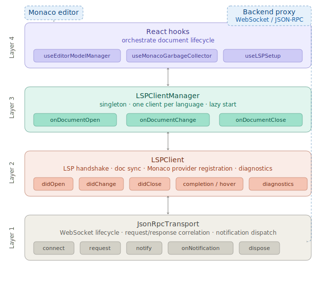

# 🧠 Quantum IDE Web Editor

This project is a web-based Quantum IDE designed to support intuitive quantum programming. It integrates:

    QLP Text Editor – for writing code in a quantum programming language.

    Qubit Circuit Builder – a graphical interface to build quantum circuits.

    Other views like the mathematical representation and the quanten possibilities

    Multidirectional Sync – any change in the code updates the circuit, etc.

The goal is to bridge textual and visual quantum programming, making development easier for both beginners and experts.
---
## Development

### Local Setup

The frontend reads backend URLs from environment variables. For local development these are
pre-configured in `.env.development` (committed, no action required):

| Variable | Default | Purpose |
|---|---|---|
| `VITE_API_URL` | `http://localhost:8080` | REST API base URL |
| `VITE_WS_URL` | `ws://localhost:8080` | WebSocket base URL (LSP) |

To point at a different backend, create a `.env.development.local` file (gitignored) and
override the values there — this file takes precedence over `.env.development`:
```bash
VITE_API_URL=http://localhost:9090
VITE_WS_URL=ws://localhost:9090
```

---

### Linting
For linting use this command.
```bash
npm run lint
```

### To configure auto formatter using prettier and husky follow this steps:
1. in root Quak folder `npm install`
2. run `git config core.hooksPath .husky`
3. If the file has no rights run `chmod +x .husky/pre-commit`
---
## Testing
This project uses [Vitest](https://vitest.dev/) for testing.

* **Run all tests:**
  ```bash
  npm test
  ```
* **Watch mode (automatic re-run on changes):**
  ```bash
  npm run test:watch
  ```
* **Interactive UI:**
  ```bash
  npm run test:ui
  ```
* **Coverage report:**
  ```bash
  npm run test:coverage
  ```
---

### Testing Strategy
#### Unit Tests (Logic & Engine)
Testing isolated **business logic** without any dependency on the UI

#### Component Tests
Component tests **simulate user interaction** and **validate how the UI reacts** to different states of the simulation.

---

### Writing new Tests
- **File Naming**: Place test files next to the source code with the extension .test.ts (for logic) or .test.tsx (for components).

- **Setup**: The environment is configured in src/test/setup.ts to provide necessary polyfills (like ResizeObserver for charts) and testing-library extensions.

---

## LSP Client Architecture



The LSP client is a three-layer stack:

| Layer | File | Responsibility |
|---|---|---|
| Transport | `src/lsp/JsonRpcTransport.ts` | WebSocket lifecycle, JSON-RPC framing, request/response correlation |
| Client | `src/lsp/LSPClient.ts` | LSP initialize handshake, document sync, Monaco provider registration, diagnostics |
| Manager | `src/lsp/LSPClientManager.ts` | One client per language, lazy startup, document routing, auto-recovery |

### Adding a new language (frontend side)

The backend must already have the language server configured (see `backend/lsp/README.md`).
On the frontend, two files need to change:

**1. Register the language in [`src/views/text-editor-view/languages/languages.ts`](src/views/text-editor-view/languages/languages.ts)**

```
// Without custom syntax highlighting (Monaco built-in or plaintext):
new Language('<id>', '<ext>', '<Display Name>', '<id>'),

// With a Monarch tokenizer (see openqasm.ts for an example):
new Language('<id>', '<ext>', '<Display Name>', '<id>', myTokenizer),
```

**2. Add the server URL in [`src/hooks/editor/useLSPSetup.ts`](src/hooks/editor/useLSPSetup.ts)**

```
{ languageId: '<id>', wsUrl: `${wsBase}/lsp/<id>` },
```

The `LSPClient` negotiates server capabilities automatically on connect. Features not advertised
by the server (completion, hover, go-to-definition) are never registered as Monaco providers.